# 饥荒联机版 Linux 云服务器开服教程

*事先声明，本教程以 腾讯云 为例，这是我自费购买用于和朋友联机，并非广告，你也可以自行购买其他厂商云服，如 华为云、阿里云 等*


## 1. 购买云服

如果是新用户可选择新用户入口


产品类型选择轻量应用服务器，区域选择离自己近的、或者是和联机朋友中间的，配置至少 **2核4G** ，如果是新用户时长建议选择 **1年** 或以上，老用户则按月购买，富哥随意


区域选择离自己近的、或者是和联机朋友中间的，镜像选择 `Debian` ，其他别管


## 2. 配置服务器

- 开放端口：DST 默认使用 **`10999` `10998` `10888`** 这些端口，需要防火墙开放这些端口，如自定义端口则按实际情况放开，这里以放开端口范围为例


- 安装 `steamcmd` 和 `DST` ：上传上面下载的 **[dst.sh](dst.sh)** 脚本到服务器，这里以云服平台提供的网页工具为例
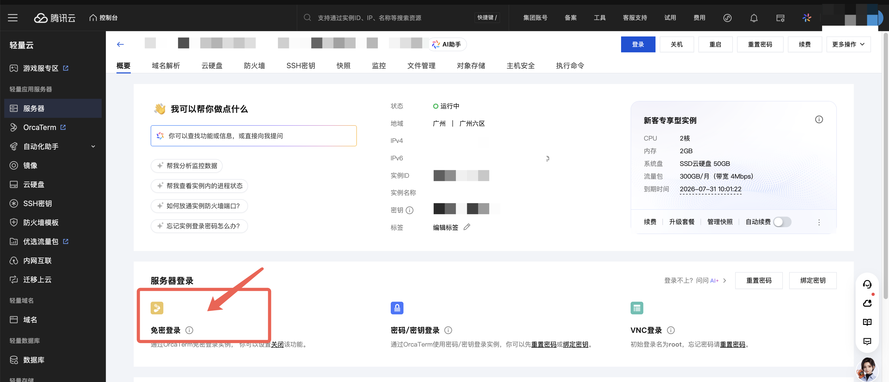
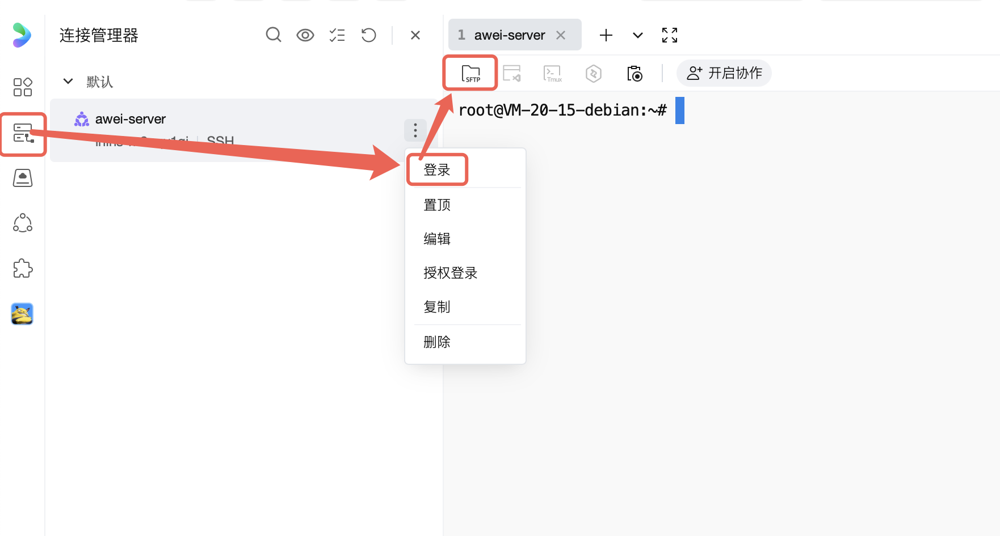
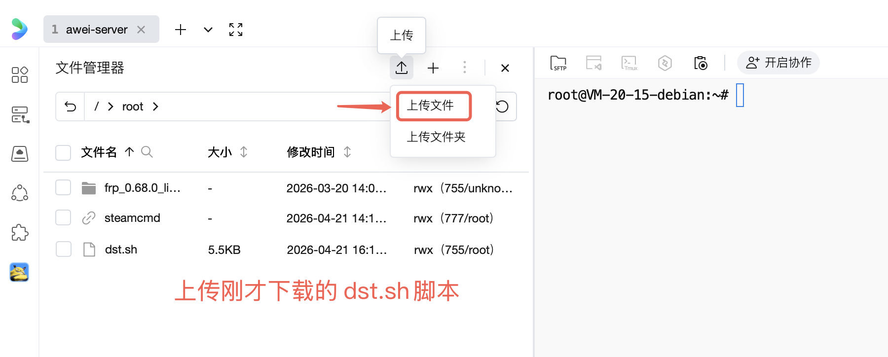

执行命令给脚本赋权
```bash
chmod +x dst.sh
```
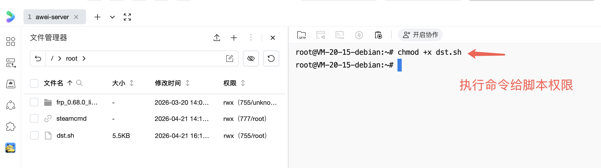

运行脚本，会自动安装 `steamcmd` 和 `DST`
```bash
sudo ./dst.sh
```
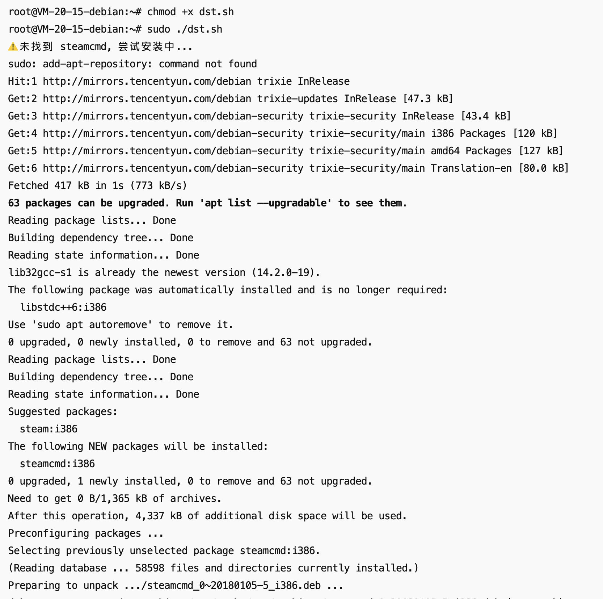

按方向键 `>` 选中 Ok 再回车
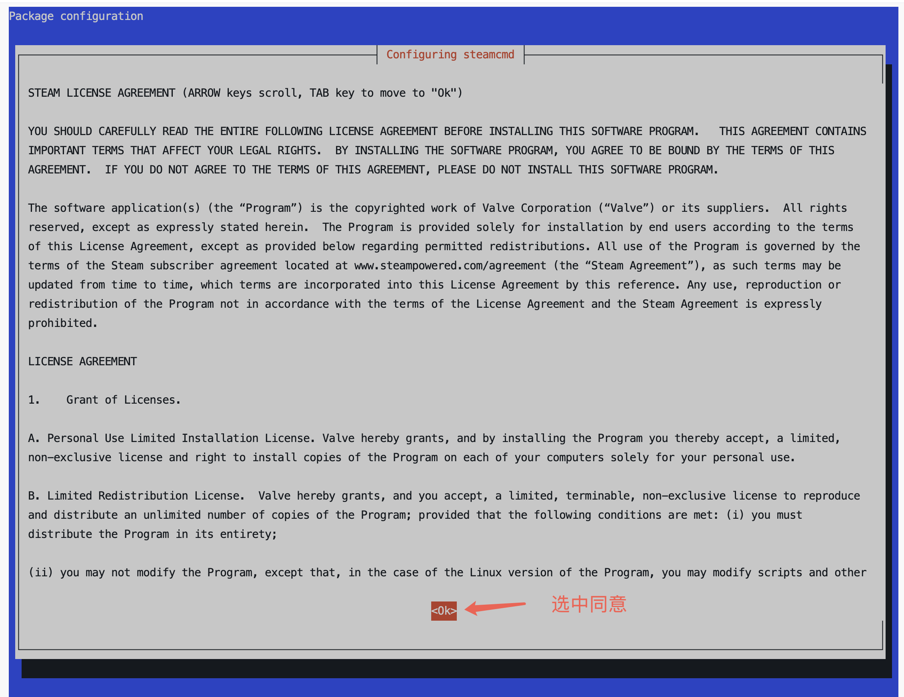

按方向键 `v` 选中 I AGREE 再回车
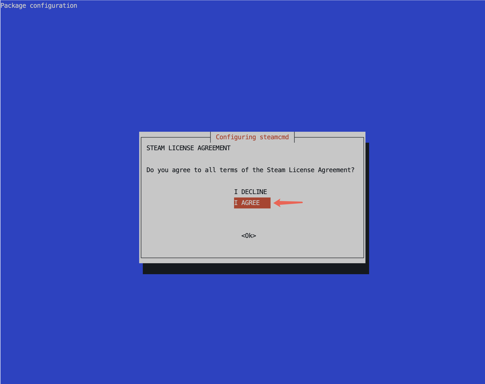

之后会自动安装 DST 
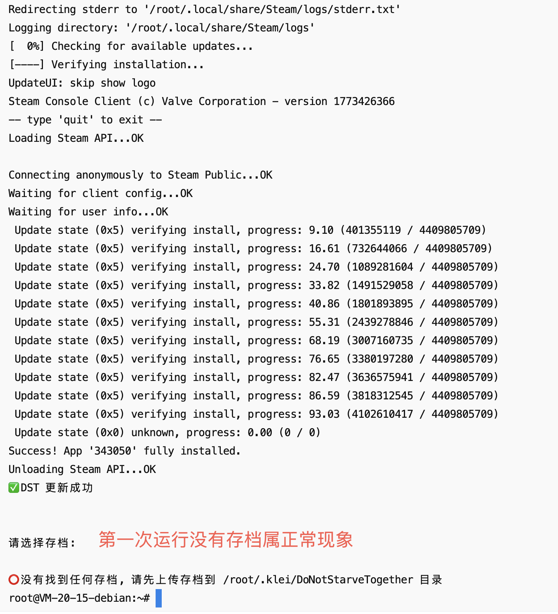
安装成功时会有提示


## 3. 上传存档

- 找到云服存档位置：DST的存档路径以 `.` 开头，所以要把隐藏文件放出来
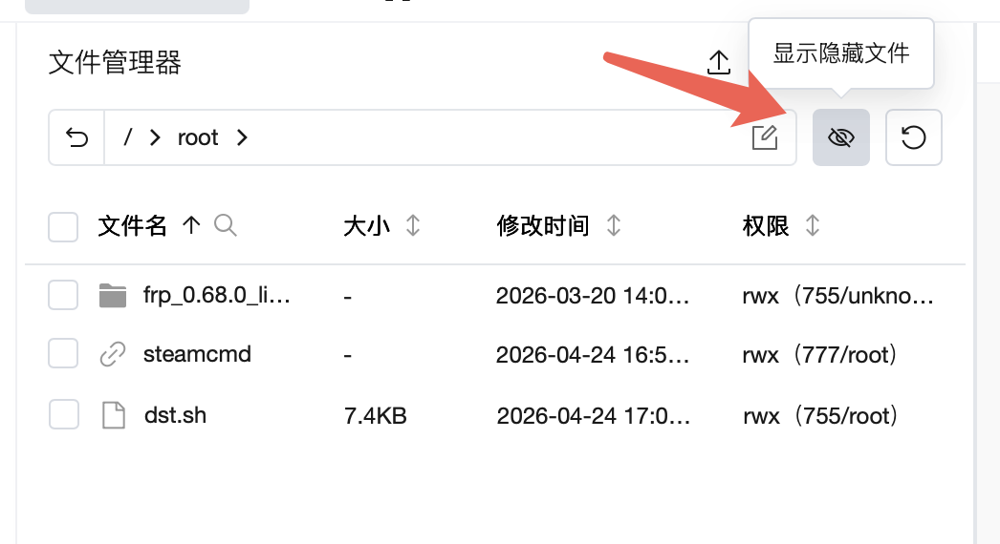
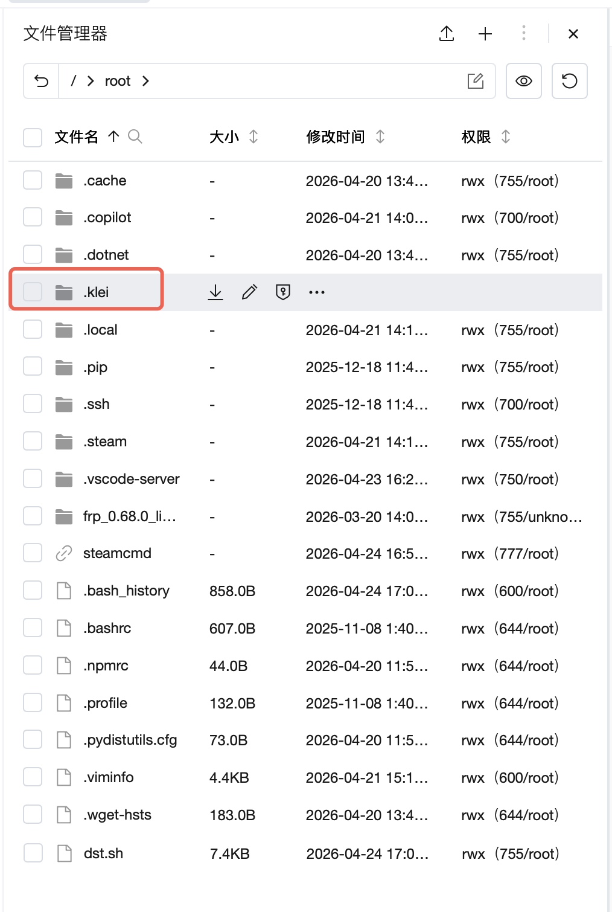
进到 DST 存档文件夹下
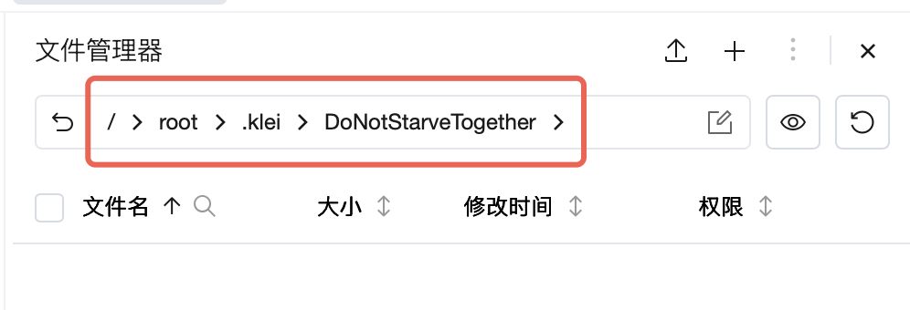

- 打开游戏，创建新存档，配置世界，选择启用MOD并配置，进到选人界面之后就可以退出了；退出来之后在存档列表找到刚才的存档并在右边菜单打开文件位置

## 待续
