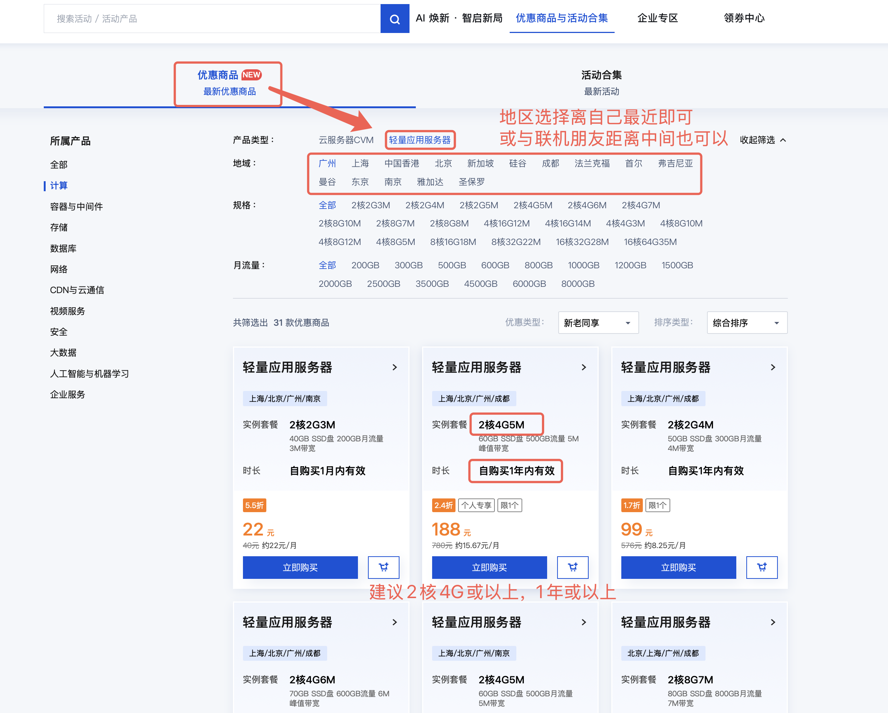
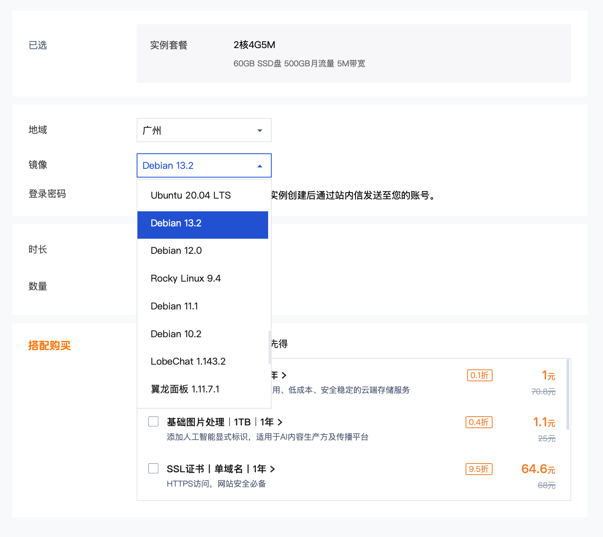
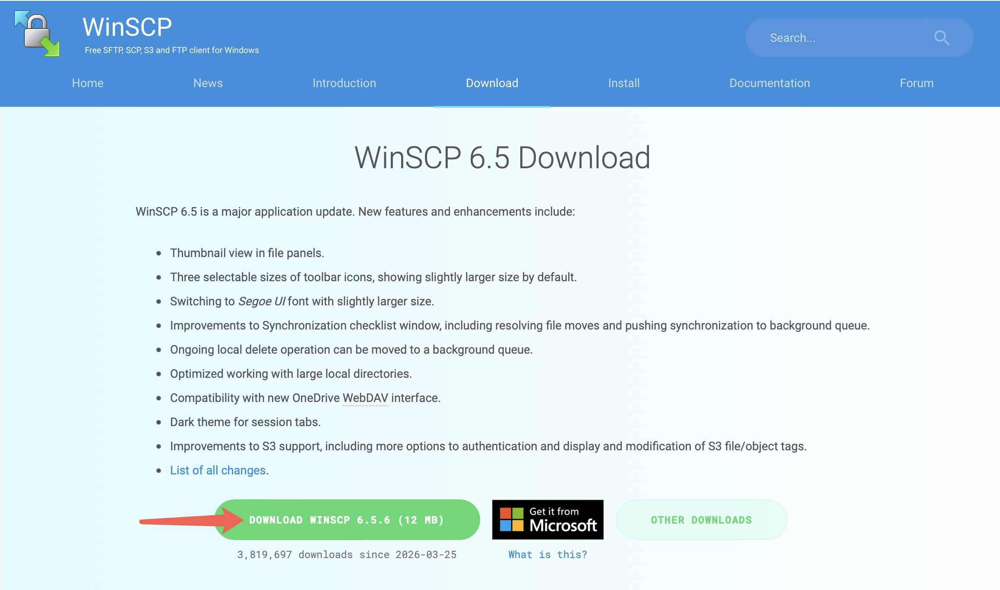
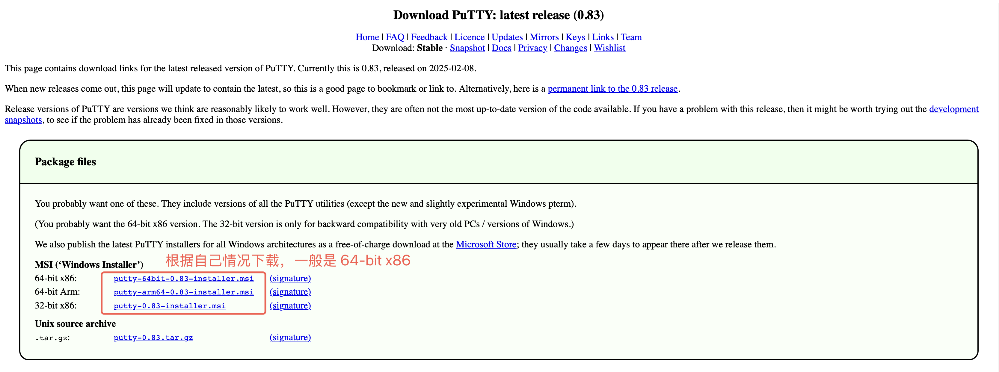
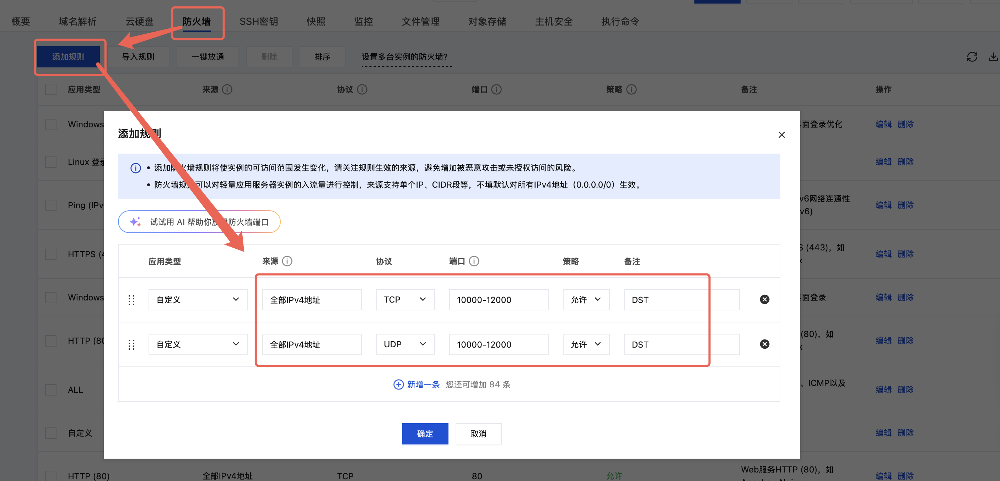

# 饥荒联机版 Linux 云服务器开服教程

*事先声明，本教程以 腾讯云 为例，本人自费购买用于和朋友联机，并非广告，你也可以自行购买其他厂商云服，如 华为云、阿里云 等*


## 1. 准备

购买云服: 如果是新用户可选择新用户入口

产品类型选择轻量应用服务器，区域选择离自己近的、或者是和联机朋友中间的，配置至少 **2核4G** ，如果是新用户时长建议选择 **1年** 或以上，老用户则按月购买，富哥随意

区域选择离自己近的、或者是和联机朋友中间的，镜像选择 `Debian` ，其他默认


下载安装 **WinSCP** [https://winscp.net/eng/download.php](https://winscp.net/eng/download.php)


下载安装 **putty** [https://www.chiark.greenend.org.uk/~sgtatham/putty/latest.html](https://www.chiark.greenend.org.uk/~sgtatham/putty/latest.html)



## 2. 配置服务器

开放端口：DST 默认使用 **`10999` `10998` `10888`** 这些端口，若果是自定义端口则按实际情况放开，这里以放开端口范围为例


下载脚本
```bash
wget -O dst.sh https://raw.githubusercontent.com/ch-awei/dst-dedicated-server/main/dst.sh
```

执行命令给脚本赋权
```bash
chmod +x dst.sh
```

运行脚本，会自动安装 `steamcmd` 和 `DST`
```bash
sudo ./dst.sh
```

按方向键 `>` 选中 Ok 再回车

按方向键 `v` 选中 IAGREE 再回车

之后会自动安装 DST ，安装成功时会有提示


## 3. 上传存档

<!-- DST的存档路径以 `.` 开头，为隐藏文件夹，要先放出来，再进到 DST 存档文件夹下 -->

打开游戏 -> 创建新存档 -> 配置世界 -> 配置MOD -> 进到选人界面 -> 退出；
退出来之后在存档列表找到刚才的存档并在右边菜单打开文件位置

## 待续
